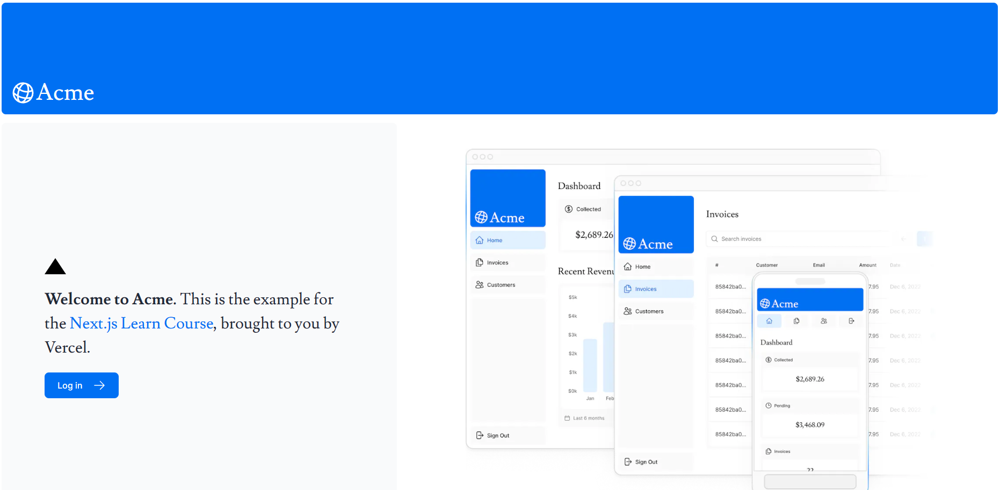
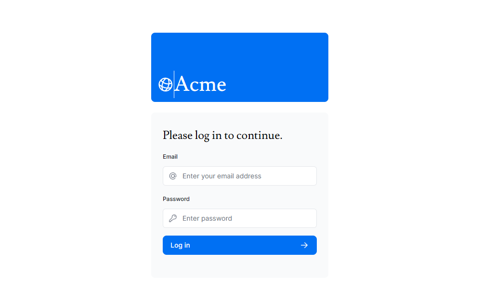
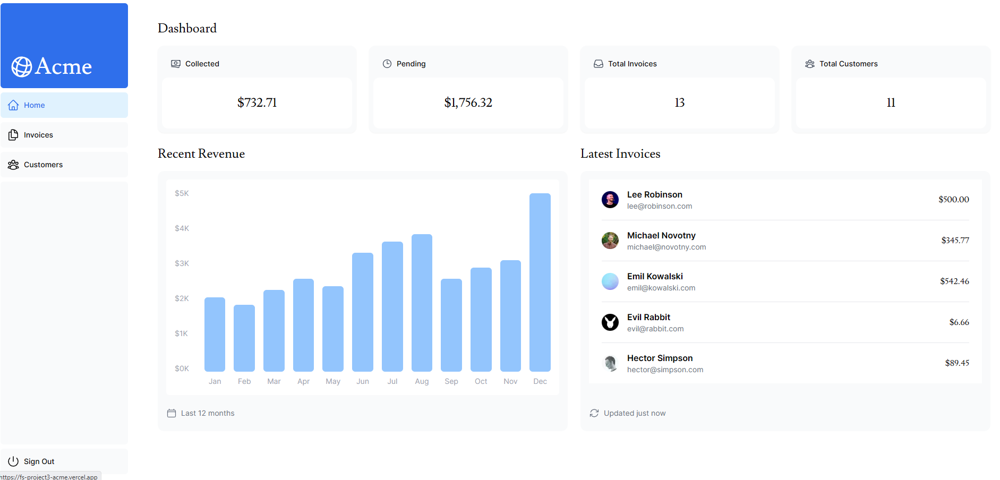
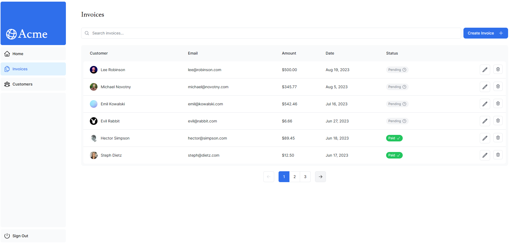
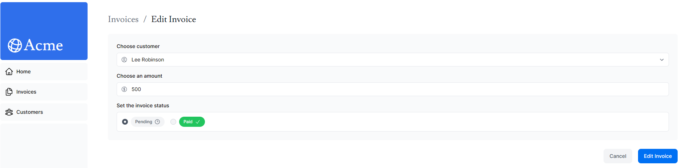
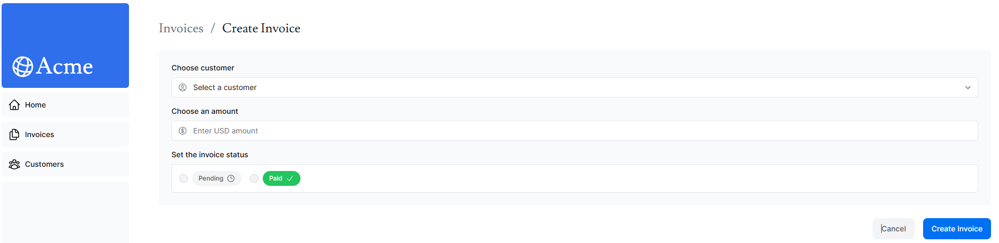
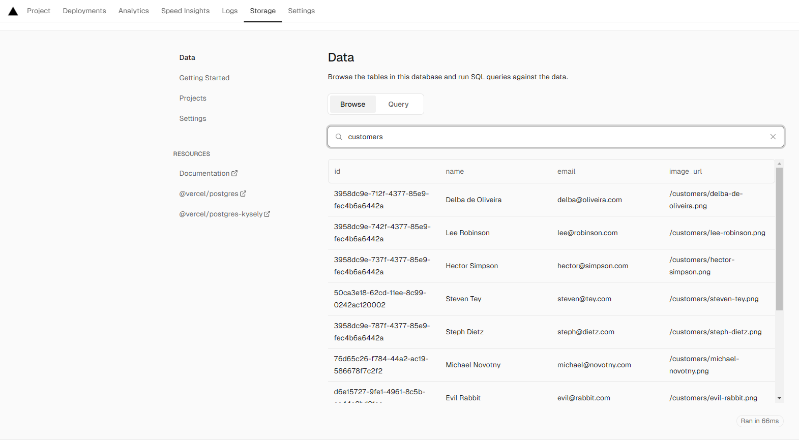

# Full Stack: React & Next.js projekti

# Sisällysluettelo

[1 Yleistä tietoa projektista](#yleistä-tietoa-projektista)   
[2 Käytettyjä tekniikoita ja erikoisuuksia](#käytettyjä-tekniikoita-ja-erikoisuuksia)   
[3 Sivuston rakenne](#sivuston-rakenne)   
[4 Linkit](#linkit)   
[4.1 Verkkosivuni osoite](#verkkosivuni-osoite)   
[4.2 Linkki GitHub repositorioon](#linkki-github-repositorioon)]   
[4.3 Linkki projektin videoesitykseen](#linkki-projektin-videoesitykseen)   
[5 Lähteet](#lähteet)   

# Yleistä tietoa projektista

Tässä projektissa olen rakentanut Vercel:in tuottaman tutoriaalin
pohjalta yksinkertaistetun taloushallinnon "dashboardin" käyttäen
Next.js-frameworkia. Next.js tarjoaa tehokkaat työkalut sekä
palvelinpuolen renderöintiin että staattisten web-sivustojen
tuottamiseen, mikä tekee siitä ihanteellisen valinnan full-stack
sovellusten kehitykseen. Projektin tavoitteena oli luoda
käyttäjäystävällinen ja toimiva sovellus, joka demonstroi modernin
web-sovelluksen rakentamista alusta loppuun. (Vercel Inc. 2024.)

Suurin osa koodista annettiin valmiiksi, mutta jokainen lisätty rivi
käytiin suhteellisen syvällisesti läpi. Oppaan mukaan tämä monesti
vastaakin tosielämän tilannetta työelämässä, sillä usein projekteissa
käytetään erilaisia valmiita kirjastoja ja pohjia.

# Käytettyjä tekniikoita ja erikoisuuksia

Varsinaisia erikoisuuksia ei ole käytetty vaan pikemmin tämän päivän
standardi työkaluja. Tutustuminen näihin takaa melko hyvät näkymät
web-sovelluskehityksen tiimoilta tulevaisuudessa.

-   **Next.js:** Sovelluksen runkona, tarjoaa tehokkaat työkalut sekä
    palvelinpuolen että asiakaspuolen kehitykseen.

-   **React:** Käyttöliittymän rakentamiseen, hyödyntäen
    komponenttipohjaista arkkitehtuuria.

-   **NextAuth.js:** Autentikaation käsittelyyn.

-   **Prisma/TypeORM:** Tietokantayhteyksien hallintaan (riippuen siitä,
    mitä tietokantaohjelmistoa käytät).

-   **Tailwind CSS/Chakra UI:** Ulkoasun ja tyylit.

-   **Vercel:** Sovelluksen sekä taustalla tietojen säilömiseen käytetyn
    PostgreSQL-tietokannan deployaamiseen.

# Sivuston rakenne

React -komponentit ja niiden tyylimäärittelyt olivat jo oppaan puolesta
toteutettuna. Näin ollen graafiseen ulkoasuun ei juuri fontteja lukuun
ottamatta tarvinnut kajota. Sivuston keskeiset ominaisuudet ja rakenne
voidaan kuvata seuraavasti:

**1. Julkinen kotisivu:** Käyttäjät voivat nähdä dashboardin kotisivun
ilman kirjautumista.



**2. Kirjautumissivu:** Turvallinen kirjautuminen käyttäen
NextAuth.js-kirjastoa, mikä mahdollistaa autentikaation eri strategioita
käyttäen.



**3. Suojatut Dashboard-sivut:** Vain kirjautuneet käyttäjät voivat
nähdä tärkeät taloustiedot ja toiminnot.



**4. Laskun lisäys, muokkaus ja poisto:** Käyttäjät voivat hallinnoida
laskujaan suoraan dashboardilta.







**5. Tietokanta:** Projektissa käytetään PostgreSQL -tietokantaa
käyttäjätietojen ja laskutietojen tallentamiseen. Myöhemmässä vaiheessa
kurssia opitaan, miten tietokanta perustetaan ja yhdistetään
sovellukseen.

   

# Linkit

## Verkkosivuni osoite 

Sivusto löytyy osoitteesta:
```
https://fs-project3-acme.vercel.app/
```   
Halutessasi voit testata toimintoja tunnuksilla <user@nextmail.com> ja
PWD: 123456

## Linkki GitHub repositorioon

```
https://github.com/fin-nidhogg/fs_project3_next
```   

## Linkki projektin videoesitykseen

#  Lähteet

Sähköiset

Vercel Inc 2024. Learn Next.js. Viitattu 9.5.2024.
```
https://nextjs.org/learn/dashboard-app
```
